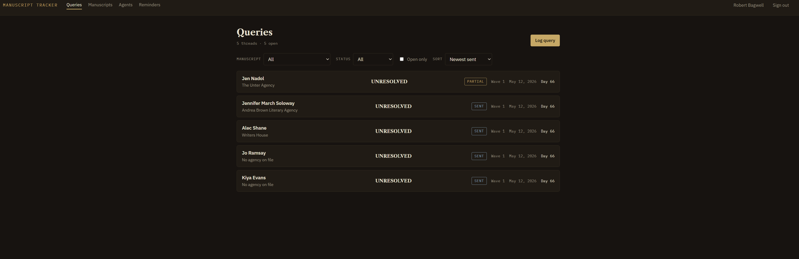
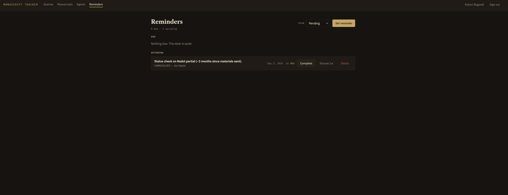

# Manuscript Tracker


Query tracking for working authors — every submission, request, rejection,
and nudge in one event-sourced ledger.

Built by a novelist actively in the query trenches, as both a daily-use
tool and a working demonstration of production Laravel + React practice.
The seed data is a real querying wave.





## Why this exists

Querying literary agents is a long game of parallel threads: five letters
out, a partial with one agent, a nudge owed in three weeks, and an agency
whose policy means a colleague's rejection closes every door in the
building. Spreadsheets record events; they don't understand them. This
tracker models the process as it actually behaves:

- **The correspondence log is the truth.** A query's status is a cached
  projection of an append-only event stream (sent → partial requested →
  materials sent → …). One write path, `recordEvent()`, keeps the cache
  honest — and makes response-time analytics a query away.
- **Advisories, not roadblocks.** Logging a query against a second agent
  at a "one no means all no" agency that already passed returns a warning
  in `meta`, not a 422. The tool flags "are you sure?" moments without
  overruling the author.
- **Nudge timing is the whole game.** Polymorphic reminders attach to
  query threads, manuscripts, or agents, surface when due, and snooze in
  one click.

## Features

Manuscripts, agents, and agencies with full CRUD and cascade-aware
deletes · event-driven query lifecycle with an inline correspondence
ledger · closed-door and closed-agent warnings · reminders with due
badges and snooze · jsonb genre filtering (GIN-indexed on Postgres) ·
server-side whitelisted sorting · Sanctum SPA cookie auth with profile
management and full password recovery (Mailpit dev mailbox) · 43 feature
tests on a hermetic sqlite `:memory:` database.

## Stack

Laravel 13 (API-only) · React 18 + TypeScript + Vite · PostgreSQL ·
Redis · nginx · Mailpit · Docker Compose. No UI framework — the design
system is ~600 lines of handwritten CSS (IBM Plex + Libre Caslon,
carbon-and-paper palette, status rendered as semantic ink).

## Quick start

```bash
git clone https://github.com/RDBagwell/manuscript-tracker.git
cd manuscript-tracker
make dev-setup      # build images, start services, run migrations
make fresh          # seed the demo data (a real querying wave)
```

Open http://localhost (or `http://localhost:$NGINX_PORT` if 80 is taken)
and sign in as `robert@example.test` / `password`. The Mailpit inbox for
password-reset mail lives at http://localhost:8025.

Deeper configuration: [DOCKER_SETUP.md](DOCKER_SETUP.md) ·
[QUICK_START.md](QUICK_START.md)

## Testing

```bash
make test
```

The target injects the test environment at `docker-compose exec` time —
`APP_ENV=testing`, sqlite `:memory:`, array drivers — because
container-provided env reaches PHP via `$_SERVER` and outranks
`phpunit.xml` overrides. Tests are structurally incapable of touching
the dev database. CI runs the identical environment.

## Architecture notes

Decisions a reviewer might ask about:

- **Event sourcing where it earns its keep.** Only the query lifecycle is
  event-sourced — it's the one place history *is* the product. Everything
  else is plain CRUD.
- **Enforced morph map.** Polymorphic reminders store `query` /
  `manuscript` / `agent` aliases, not class names; a data migration
  converted pre-map rows the day the map arrived.
- **Tenancy at two layers.** Policies (403) guard direct access;
  validation-level `exists`-with-`user_id` rules (422) stop cross-tenant
  foreign keys at the door.
- **Hermetic tests as a hard requirement**, learned the interesting way —
  see below.

## Bugs this repo survived

Documented because they're the instructive kind:

1. **The APP_KEY that couldn't lose, and did** — compose injected a
   placeholder key as process env; the entrypoint's `key:generate`
   dutifully wrote a real one to `.env`… which process env silently
   outranks. First Encrypter touch, 500.
2. **A shebang assassinated by Windows** — `git apply` under
   `autocrlf=true` rewrote the entrypoint with CRLF endings; the baked
   image's kernel went looking for `/bin/sh\r`. Instant restart loop,
   zero log lines. `.gitattributes` now enforces LF on anything executed.
3. **`$_SERVER` beats `$_ENV`** — PHPUnit's `<env>` overrides never stood
   a chance against compose-provided variables, so "sqlite" tests ran
   against dev Postgres and `RefreshDatabase` ate the seed data. Twice.
   Hence exec-time env injection.
4. **Node modules that rose from the grave** — `docker-compose down`
   discards anonymous volumes and reseeds from the image, resurrecting
   whatever `node_modules` existed at last build. `make frontend-rebuild`
   is the named cure.

## Roadmap

Stats dashboard (response times and request rates from the event
stream) · query-letter template management · production static build
behind nginx · live deployment.

---

Built by Robert Bagwell — full-stack engineer and fiction author.
